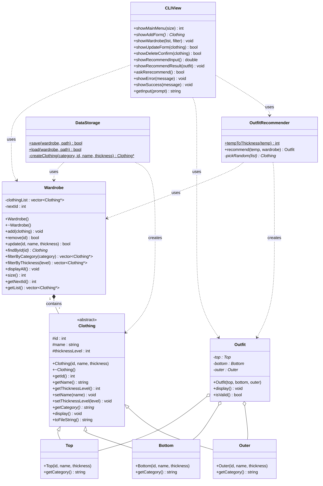
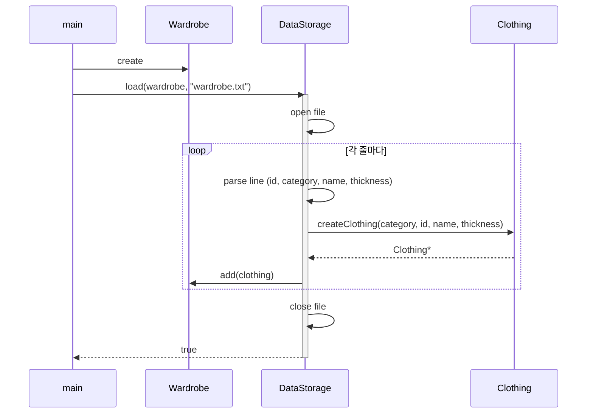
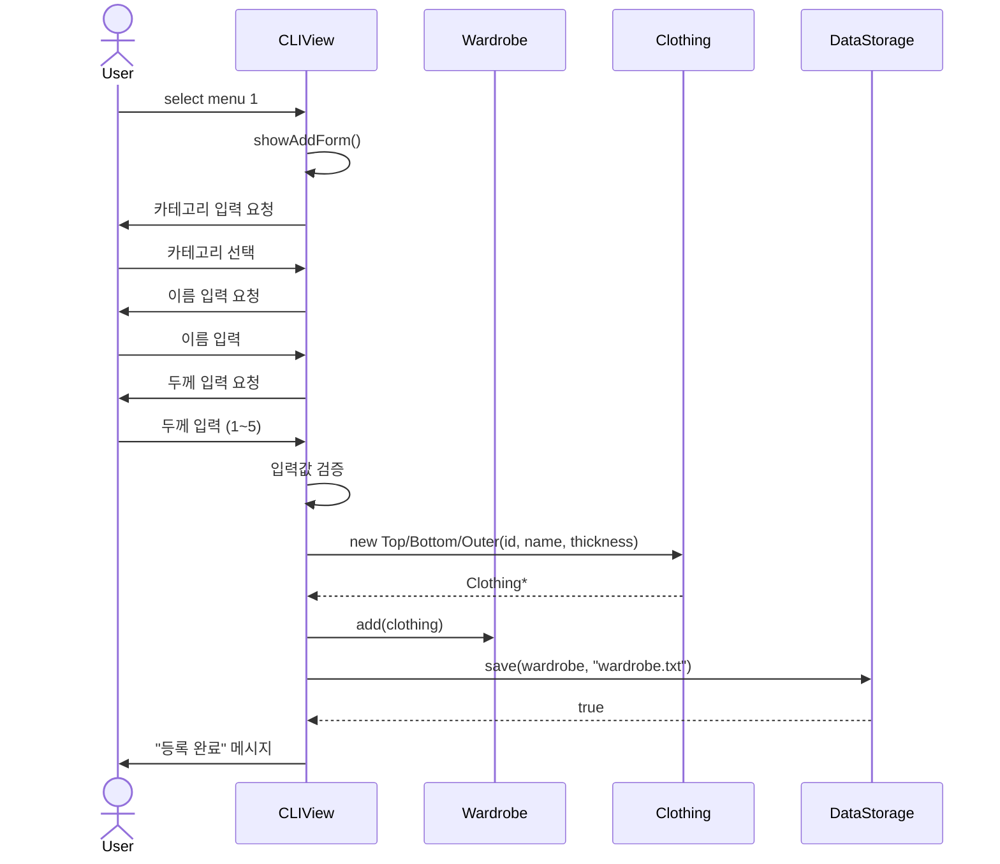
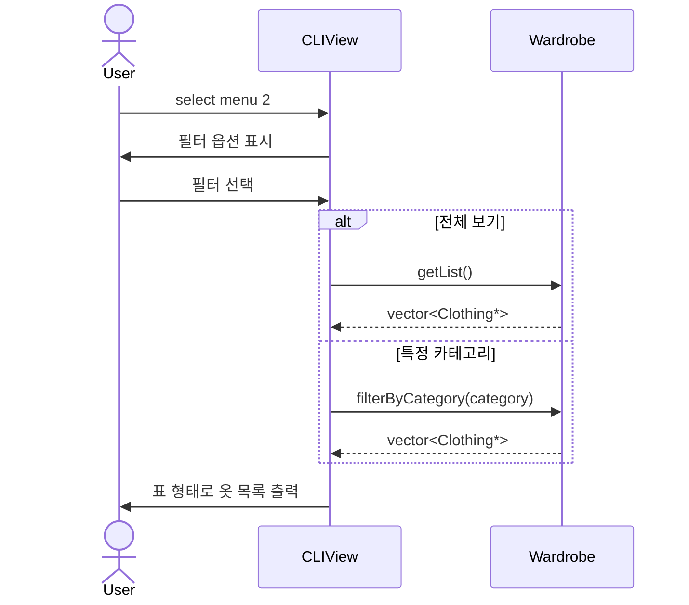
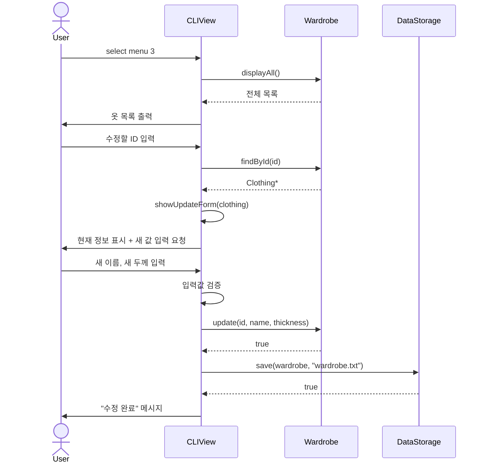
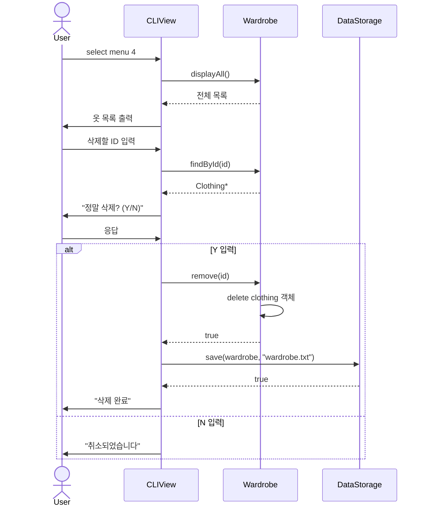
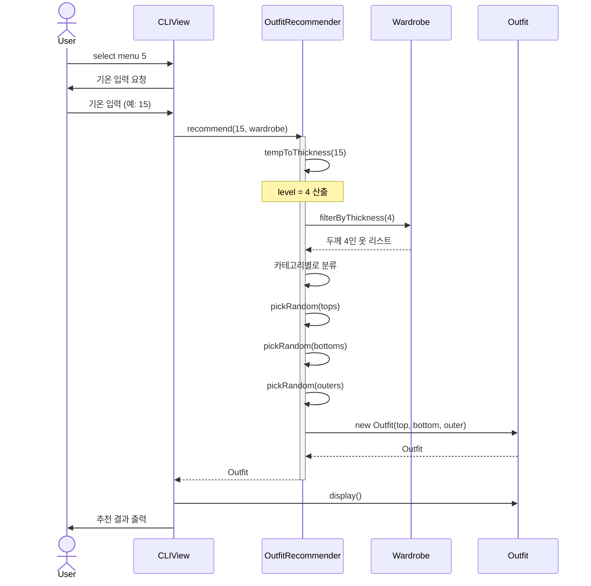
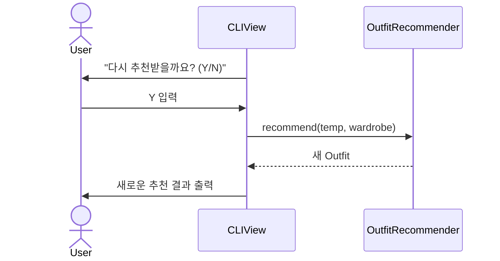
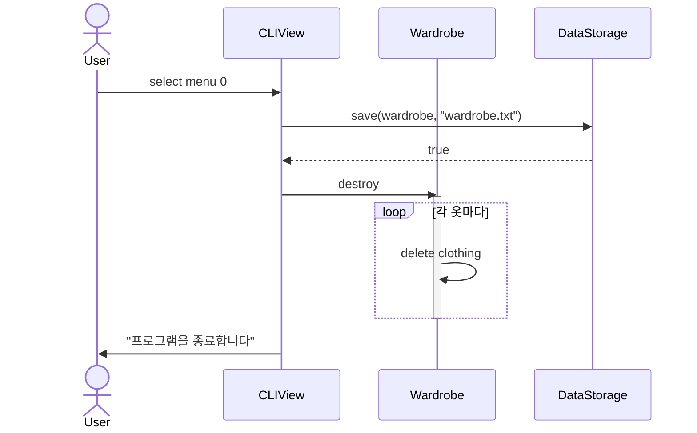
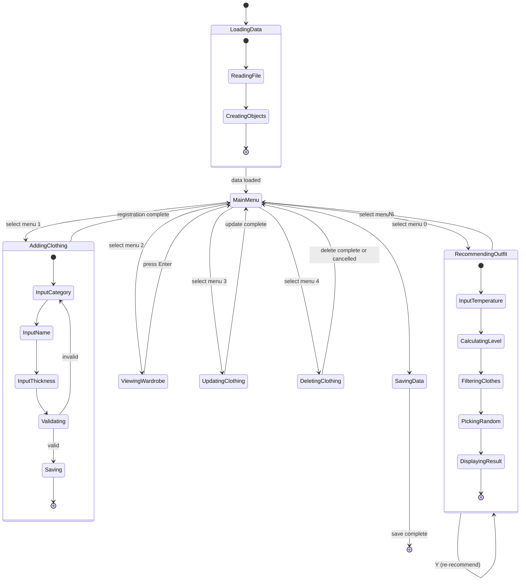

# 날씨 맞춤형 외출복 코디 추천 프로그램 WC

\- 3. Design -

**Student No**: 22213505

**Name**: 김재형

**E-mail**: [본인 이메일 주소]

---

## [ Revision history ]

| Revision date | Version # | Description | Author |
| :-----------: | :-------: | :--- | :----: |
|  2025-XX-XX   |    1.0    | 초안 작성    | 김재형 |

---

## [ Contents ]

1. Introduction
2. Class Diagram
3. Sequence Diagram
4. State Machine Diagram
5. Implementation requirements
6. Glossary
7. References

---

## 1. Introduction

### 1.1 Summary

이 문서는 'WC(Weather Coordinator) - 날씨 맞춤형 외출복 코디 추천 프로그램'의 설계 단계 산출물이다. 앞서 작성한 Analysis 문서에서 식별한 클래스와 유스케이스를 토대로, 구현 가능한 수준까지 시스템 구조를 구체화하는 것을 목표로 한다. 클래스의 속성과 메서드를 타입까지 명확히 정의하고, 각 유스케이스가 객체들 사이에서 어떤 순서로 메시지를 주고받는지 시퀀스 다이어그램으로 표현한다. 또 프로그램 전체의 상태 흐름을 상태 머신 다이어그램으로 나타낸다.

### 1.2 Important Points of Design

본 설계에서 중점을 둔 부분은 다음과 같다.

**(1) 책임 분리 (Separation of Concerns)**

비즈니스 로직(Wardrobe, OutfitRecommender), 데이터 영속성(DataStorage), 화면 출력(CLIView)을 각각 다른 클래스로 분리했다. 나중에 GUI로 옮기거나 저장 방식을 DB로 바꾸더라도 영향을 최소화하기 위함이다.

**(2) 다형성 활용 (Polymorphism)**

`Clothing` 추상 클래스를 부모로 두고 `Top`, `Bottom`, `Outer`가 상속받는 구조로 설계해서, `vector<Clothing*>` 하나로 옷 종류와 관계없이 일관되게 관리할 수 있게 했다. 옷 종류가 늘어나도 기존 코드 수정 없이 자식 클래스만 추가하면 된다.

**(3) 데이터 영속성 (Persistence)**

옷장 데이터를 텍스트 파일(`wardrobe.txt`)에 직렬화해서 저장하고, 프로그램 시작 시 역직렬화로 복원한다. 변경이 일어날 때마다 즉시 저장하는 방식으로 데이터 손실을 막는다.

**(4) 견고한 입력 처리 (Robust Input Handling)**

CLI 환경에서는 사용자가 잘못된 입력을 줄 가능성이 높다. 모든 입력 단계에서 유효성 검증을 거치며, 잘못된 값이 들어와도 프로그램이 종료되지 않고 다시 입력받도록 설계했다.

---

## 2. Class Diagram

본 시스템은 7개의 핵심 클래스로 구성된다. `Clothing` 추상 클래스를 중심으로 한 상속 구조와, `Wardrobe`를 중심으로 한 컨테이너 구조가 핵심이다.

### 2.1 Overall Class Diagram



[그림 2-1] Overall Class Diagram

### 2.2 Class Descriptions

각 클래스의 속성(Attributes)과 메서드(Methods)를 상세히 정의한다.

#### 2.2.1 Clothing (추상 클래스)

| Class Description |
| :--- |
| 시스템이 다루는 모든 옷의 공통 속성과 동작을 정의하는 추상 클래스. `Top`, `Bottom`, `Outer`가 이를 상속받는다. |

| Attributes | | |
| :--- | :--- | :--- |
| Name | Type | Description |
| `id` | `int` | 옷의 고유 식별 번호 |
| `name` | `string` | 옷의 이름 |
| `thicknessLevel` | `int` | 옷의 두께 레벨 (1~5) |

| Methods | | | |
| :--- | :--- | :--- | :--- |
| Name | Arguments | Return | Description |
| `Clothing(id, name, thickness)` | `int, string, int` | - | 생성자 |
| `~Clothing()` | - | - | 가상 소멸자 |
| `getId()` | - | `int` | id 반환 |
| `getName()` | - | `string` | name 반환 |
| `getThicknessLevel()` | - | `int` | thicknessLevel 반환 |
| `setName(name)` | `string` | `void` | name 수정 |
| `setThicknessLevel(level)` | `int` | `void` | thicknessLevel 수정 |
| `getCategory()` | - | `string` | 카테고리 반환 (순수 가상 함수) |
| `display()` | - | `void` | 옷 정보를 콘솔에 출력 (가상 함수) |
| `toFileString()` | - | `string` | 파일 저장용 직렬화 문자열 반환 (가상 함수) |

#### 2.2.2 Top (상의)

| Class Description |
| :--- |
| `Clothing`을 상속받아 '상의' 카테고리를 표현하는 클래스. |

| Methods | | | |
| :--- | :--- | :--- | :--- |
| Name | Arguments | Return | Description |
| `Top(id, name, thickness)` | `int, string, int` | - | 생성자, 부모 생성자 호출 |
| `getCategory()` | - | `string` | "Top" 반환 (오버라이드) |

#### 2.2.3 Bottom (하의)

| Class Description |
| :--- |
| `Clothing`을 상속받아 '하의' 카테고리를 표현하는 클래스. |

| Methods | | | |
| :--- | :--- | :--- | :--- |
| Name | Arguments | Return | Description |
| `Bottom(id, name, thickness)` | `int, string, int` | - | 생성자, 부모 생성자 호출 |
| `getCategory()` | - | `string` | "Bottom" 반환 (오버라이드) |

#### 2.2.4 Outer (아우터)

| Class Description |
| :--- |
| `Clothing`을 상속받아 '아우터' 카테고리를 표현하는 클래스. |

| Methods | | | |
| :--- | :--- | :--- | :--- |
| Name | Arguments | Return | Description |
| `Outer(id, name, thickness)` | `int, string, int` | - | 생성자, 부모 생성자 호출 |
| `getCategory()` | - | `string` | "Outer" 반환 (오버라이드) |

#### 2.2.5 Wardrobe (옷장)

| Class Description |
| :--- |
| 등록된 모든 의류 객체를 담아 관리하는 컨테이너 클래스. `Clothing` 객체에 대한 CRUD 기능을 제공한다. |

| Attributes | | |
| :--- | :--- | :--- |
| Name | Type | Description |
| `clothingList` | `vector<Clothing*>` | 모든 옷 객체를 담는 리스트 |
| `nextId` | `int` | 다음에 할당할 옷 ID |

| Methods | | | |
| :--- | :--- | :--- | :--- |
| Name | Arguments | Return | Description |
| `Wardrobe()` | - | - | 생성자, nextId를 1로 초기화 |
| `~Wardrobe()` | - | - | 소멸자, 모든 동적 할당 옷 객체 해제 |
| `add(clothing)` | `Clothing*` | `void` | 옷 객체를 리스트에 추가 |
| `remove(id)` | `int` | `bool` | id에 해당하는 옷 삭제 (성공 시 true) |
| `update(id, name, thickness)` | `int, string, int` | `bool` | 옷 정보 수정 |
| `findById(id)` | `int` | `Clothing*` | id로 옷 객체 검색 |
| `filterByCategory(category)` | `string` | `vector<Clothing*>` | 카테고리로 필터링 |
| `filterByThickness(level)` | `int` | `vector<Clothing*>` | 두께 레벨로 필터링 |
| `displayAll()` | - | `void` | 모든 옷 정보 출력 |
| `size()` | - | `int` | 옷장의 옷 개수 반환 |
| `getNextId()` | - | `int` | 다음 ID를 반환하고 nextId 증가 |
| `getList()` | - | `vector<Clothing*>&` | 옷 리스트 참조 반환 |

#### 2.2.6 OutfitRecommender (코디 추천기)

| Class Description |
| :--- |
| 입력된 기온을 분석하여 옷장에서 적절한 옷을 선별·조합해 코디 한 세트를 만들어주는 핵심 로직 클래스. |

| Methods | | | |
| :--- | :--- | :--- | :--- |
| Name | Arguments | Return | Description |
| `tempToThickness(temp)` | `double` | `int` | 기온을 두께 레벨(1~5)로 변환 (static) |
| `recommend(temp, wardrobe)` | `double, Wardrobe&` | `Outfit` | 기온 기반으로 코디 한 세트 추천 |
| `pickRandom(list)` | `vector<Clothing*>&` | `Clothing*` | 리스트에서 무작위로 하나 선택 |

#### 2.2.7 Outfit (코디)

| Class Description |
| :--- |
| 추천된 한 세트의 코디(상의 + 하의 + 아우터)를 담는 데이터 객체. |

| Attributes | | |
| :--- | :--- | :--- |
| Name | Type | Description |
| `top` | `Top*` | 상의 객체 포인터 |
| `bottom` | `Bottom*` | 하의 객체 포인터 |
| `outer` | `Outer*` | 아우터 객체 포인터 |

| Methods | | | |
| :--- | :--- | :--- | :--- |
| Name | Arguments | Return | Description |
| `Outfit(top, bottom, outer)` | `Top*, Bottom*, Outer*` | - | 생성자 |
| `display()` | - | `void` | 코디 정보를 박스 형태로 출력 |
| `isValid()` | - | `bool` | 세 가지 카테고리가 모두 채워졌는지 확인 |

#### 2.2.8 DataStorage (데이터 저장소)

| Class Description |
| :--- |
| `Wardrobe` 객체를 텍스트 파일에 저장하고 불러오는 영속성 담당 클래스. 카테고리 문자열을 보고 자식 객체를 생성하는 팩토리 역할도 한다. |

| Methods | | | |
| :--- | :--- | :--- | :--- |
| Name | Arguments | Return | Description |
| `save(wardrobe, path)` | `Wardrobe&, string` | `bool` | 옷장 데이터를 텍스트 파일에 저장 (static) |
| `load(wardrobe, path)` | `Wardrobe&, string` | `bool` | 텍스트 파일에서 옷장 데이터 복원 (static) |
| `createClothing(category, id, name, thickness)` | `string, int, string, int` | `Clothing*` | 카테고리에 맞는 자식 객체 생성 (static, private) |

#### 2.2.9 CLIView (콘솔 화면)

| Class Description |
| :--- |
| 콘솔 입출력을 담당하는 View 클래스. 비즈니스 로직과 화면 출력을 분리하기 위해 별도로 둔다. |

| Methods | | | |
| :--- | :--- | :--- | :--- |
| Name | Arguments | Return | Description |
| `showMainMenu(wardrobeSize)` | `int` | `int` | 메인 메뉴 출력 후 사용자 선택 반환 |
| `showAddForm()` | - | `Clothing*` | 옷 추가 폼 출력 후 입력값으로 옷 객체 생성 |
| `showWardrobe(list, filter)` | `vector<Clothing*>&, string` | `void` | 옷장 목록을 표 형태로 출력 |
| `showUpdateForm(clothing)` | `Clothing*` | `bool` | 옷 수정 폼 출력 후 사용자 입력 받기 |
| `showDeleteConfirm(clothing)` | `Clothing*` | `bool` | 삭제 확인 메시지 출력 (Y/N) |
| `showRecommendInput()` | - | `double` | 기온 입력 받기 |
| `showRecommendResult(outfit)` | `Outfit&` | `void` | 추천 결과 출력 |
| `askRerecommend()` | - | `bool` | 재추천 여부 묻기 (Y/N) |
| `showError(message)` | `string` | `void` | 오류 메시지 출력 |
| `showSuccess(message)` | `string` | `void` | 성공 메시지 출력 |
| `getInput(prompt)` | `string` | `string` | 범용 입력 함수 |

### 2.3 기온-두께 매핑 규칙

`OutfitRecommender::tempToThickness()`의 내부 매핑은 다음과 같다.

| 기온 범위 (℃) | 적정 두께 | 설명 |
| :---: | :---: | :--- |
| 28 이상 | 1 | 한여름 (반팔, 얇은 면) |
| 23 ~ 27 | 2 | 늦여름·초가을 (얇은 긴팔) |
| 17 ~ 22 | 3 | 환절기 (긴팔, 얇은 가디건) |
| 10 ~ 16 | 4 | 늦가을·초겨울 (니트, 자켓) |
| 9 이하 | 5 | 한겨울 (두꺼운 코트, 패딩) |

[표 2-1] 기온-두께 매핑 기준

### 2.4 데이터 파일 포맷

`wardrobe.txt`의 형식은 다음과 같다. 한 줄에 옷 하나씩, 콤마로 구분.

```
[id],[category],[name],[thicknessLevel]
```

예시:
```
1,Top,흰색 반팔 티셔츠,1
2,Bottom,청바지,3
3,Outer,베이지 가디건,2
```

---

## 3. Sequence Diagram

각 유스케이스마다 객체들이 시간 순서대로 메시지를 어떻게 주고받는지 시퀀스 다이어그램으로 표현한다.

### 3.1 Load Wardrobe (옷장 데이터 로드)



[그림 3-1] Load Wardrobe Sequence Diagram

위 그림은 프로그램이 시작될 때 옷장 데이터를 불러오는 과정이다. `main`에서 `Wardrobe` 객체를 생성한 뒤 `DataStorage::load()`를 호출한다. `DataStorage`는 `wardrobe.txt`를 한 줄씩 읽어 콤마로 파싱한 다음, 카테고리 문자열을 보고 `createClothing()`을 통해 알맞은 자식 객체(`Top`, `Bottom`, `Outer`)를 생성한다. 생성된 객체는 `Wardrobe::add()`로 옷장에 추가된다.

### 3.2 Add Clothing (신규 의류 등록)



[그림 3-2] Add Clothing Sequence Diagram

사용자가 메인 메뉴에서 '옷 추가'를 선택하면 `CLIView::showAddForm()`이 호출되어 카테고리·이름·두께를 입력받는다. 입력값을 검증한 뒤 카테고리에 맞는 자식 객체(`Top`, `Bottom`, 또는 `Outer`)를 생성하여 `Wardrobe::add()`로 옷장에 추가한다. 변경 사항은 즉시 `DataStorage::save()`로 파일에 반영된다.

### 3.3 View Wardrobe (옷장 조회 / 필터링)



[그림 3-3] View Wardrobe Sequence Diagram

사용자가 '옷장 보기'를 선택하고 필터 옵션(전체/상의/하의/아우터)을 고르면, 선택에 따라 다른 메서드를 호출한다. 전체 보기일 경우 `Wardrobe::getList()`를, 특정 카테고리를 골랐을 경우 `Wardrobe::filterByCategory()`를 호출한다. 결과는 `CLIView`가 표 형태로 사용자에게 출력한다.

### 3.4 Update Clothing (의류 정보 수정)



[그림 3-4] Update Clothing Sequence Diagram

사용자가 '옷 수정'을 선택하면 먼저 전체 목록이 출력되고, 사용자가 수정할 옷의 ID를 입력한다. `Wardrobe::findById()`로 해당 객체를 찾아 `CLIView::showUpdateForm()`을 통해 새 값을 입력받는다. 입력값 검증 후 `Wardrobe::update()`로 객체를 갱신하고 파일에 저장한다.

### 3.5 Delete Clothing (의류 삭제)



[그림 3-5] Delete Clothing Sequence Diagram

사용자가 '옷 삭제'를 선택하고 삭제할 ID를 입력하면, `Wardrobe::findById()`로 대상 객체를 찾아 `CLIView::showDeleteConfirm()`으로 확인 메시지를 띄운다. 사용자가 'Y'를 입력하면 `Wardrobe::remove()`가 객체를 삭제하고, 동적 할당된 메모리를 해제한 뒤 파일에 변경 사항을 저장한다. 'N'을 입력하면 작업이 취소된다.

### 3.6 Recommend Outfit (기온 입력 및 코디 추천)



[그림 3-6] Recommend Outfit Sequence Diagram

핵심 기능에 해당하는 시퀀스다. 사용자가 기온을 입력하면 `OutfitRecommender::tempToThickness()`로 적정 두께 레벨이 산출된다. 그 두께 조건에 맞는 옷들을 `Wardrobe::filterByThickness()`로 골라낸 뒤, 카테고리별로 다시 분류하고 `pickRandom()`으로 각각 1벌씩 뽑는다. 세 옷이 모두 모이면 `Outfit` 객체로 묶어 반환하고, `CLIView::showRecommendResult()`로 결과를 출력한다.

### 3.7 Re-recommend (추천 결과 재요청)



[그림 3-7] Re-recommend Sequence Diagram

추천 결과 출력 후 `CLIView::askRerecommend()`로 재추천 여부를 묻는다. 사용자가 'Y'를 누르면 동일한 기온으로 `recommend()`를 다시 호출하여 새로운 무작위 조합을 받는다. 'N'을 누르면 메인 메뉴로 복귀한다.

### 3.8 Exit Program (프로그램 종료)



[그림 3-8] Exit Program Sequence Diagram

사용자가 '종료'를 선택하면 `DataStorage::save()`로 최종 데이터를 파일에 저장한다. 이후 `Wardrobe`의 소멸자가 호출되며 동적 할당된 모든 옷 객체의 메모리를 해제한다. 마지막으로 종료 메시지를 출력하고 프로그램이 끝난다.

---

## 4. State Machine Diagram

본 시스템은 네트워크 기반의 client-server 구조가 아닌, 단일 사용자 환경에서 동작하는 독립 실행형(standalone) CLI 프로그램이다. 따라서 client와 server를 분리한 별도의 상태 머신 대신, 프로그램 전체의 상태 변화를 하나의 통합된 상태 머신 다이어그램으로 표현한다.

### 4.1 Program State Machine



[그림 4-1] State Machine Diagram

프로그램이 시작되면 먼저 `Loading Data` 상태로 들어가 `wardrobe.txt`에서 옷장 데이터를 메모리에 적재한다. 로드가 끝나면 `Main Menu` 상태로 전이하여 사용자의 메뉴 선택을 기다린다.

메인 메뉴에서 사용자의 입력에 따라 6가지 상태로 분기된다. '옷 추가', '옷장 보기', '옷 수정', '옷 삭제', '코디 추천' 상태로 각각 들어갈 수 있으며, 각 상태에서 작업이 끝나면 다시 메인 메뉴로 돌아온다. `Recommending Outfit` 상태에서는 사용자가 'Y'를 누르면 추천 동작을 반복하고, 'N'을 누르면 메인 메뉴로 돌아간다.

'종료'를 선택하면 `Saving Data` 상태로 들어가 메모리의 옷장 데이터를 파일에 저장하고, 동적 할당된 메모리를 해제한 뒤 프로그램이 종료된다.

복합 상태(composite state)인 `Loading Data`, `Adding Clothing`, `Recommending Outfit` 내부에는 세부 단계가 더 있으며, 각 단계가 순차적으로 진행된다. 각 상태에서 잘못된 입력이 들어오면 해당 상태에 머무르며 다시 입력을 요청한다.

---

## 5. Implementation requirements

본 시스템을 구현하고 실행하기 위한 환경 요구사항이다.

### 5.1 H/W platform requirements

| 항목 | 요구사항 |
| :--- | :--- |
| CPU | Intel Core i3 이상 또는 동급의 AMD CPU |
| RAM | 2GB 이상 |
| HDD / SSD | 100MB 이상의 여유 공간 |
| 디스플레이 | 콘솔 출력이 가능한 텍스트 환경 (최소 80x25 character) |

### 5.2 S/W platform requirements

| 항목 | 요구사항 |
| :--- | :--- |
| OS | Windows 10 이상, macOS 10.14 이상, 또는 Linux (Ubuntu 20.04 이상) |
| 컴파일러 | C++17을 지원하는 컴파일러 (GCC 9.0 이상, MSVC 2019 이상, Clang 10 이상) |
| 표준 라이브러리 | C++ STL (`<iostream>`, `<fstream>`, `<sstream>`, `<vector>`, `<string>`, `<random>` 등) |
| 외부 라이브러리 | 없음 (표준 라이브러리만 사용) |
| 인코딩 | UTF-8 (한글 출력을 위해 Windows에서는 `chcp 65001` 사용 권장) |

### 5.3 Implementation Language

본 프로젝트는 **C++17** 표준으로 구현한다. 객체지향 설계 원칙을 적극 활용하며, 외부 라이브러리 의존성 없이 표준 라이브러리만으로 동작하도록 설계한다.

---

## 6. Glossary

| 용어 | 설명 |
| :--- | :--- |
| WC | 본 프로젝트의 이름. Weather Coordinator의 약자. |
| CLI (Command Line Interface) | 텍스트 명령어로 컴퓨터와 상호작용하는 인터페이스 방식. 본 프로그램의 실행 환경. |
| Class Diagram | 시스템의 정적 구조를 클래스 단위로 표현한 UML 다이어그램. 클래스의 속성, 메서드, 클래스 간 관계를 보여준다. |
| Sequence Diagram | 객체 간 동적 상호작용을 시간 순서대로 표현한 UML 다이어그램. |
| State Machine Diagram | 객체의 생명 주기 동안 가질 수 있는 모든 상태와 전이 조건을 나타낸 UML 다이어그램. |
| Attribute | 클래스가 가지는 데이터(속성). C++의 멤버 변수에 해당. |
| Method | 클래스가 제공하는 동작(연산). C++의 멤버 함수에 해당. |
| 추상 클래스 (Abstract Class) | 순수 가상 함수를 1개 이상 가지는, 직접 인스턴스화할 수 없는 클래스. 본 시스템의 `Clothing`이 해당. |
| 순수 가상 함수 (Pure Virtual Function) | 구현이 없고 자식 클래스에서 반드시 구현해야 하는 가상 함수. `= 0`으로 선언. |
| 다형성 (Polymorphism) | 부모 클래스 포인터로 자식 객체를 일관되게 다루는 객체지향의 특성. |
| 직렬화 (Serialization) | 메모리상의 객체를 파일에 저장하기 위해 문자열로 변환하는 작업. |
| 역직렬화 (Deserialization) | 파일에 저장된 문자열을 다시 객체로 복원하는 작업. |
| 동적 할당 (Dynamic Allocation) | `new` 키워드로 힙 메모리에 객체를 생성하는 방식. `delete`로 반드시 해제해야 한다. |
| Mermaid | 텍스트 기반으로 다이어그램을 표현하는 마크다운 확장 문법. GitHub에서 자동으로 렌더링된다. |
| 카테고리 | 옷의 종류. 본 시스템에서는 상의(Top), 하의(Bottom), 아우터(Outer) 세 가지. |
| 두께 레벨 | 옷의 두께를 1(여름용)부터 5(한겨울용)까지 정량화한 자체 기준. |
| 코디 (Outfit) | 상의·하의·아우터 각 1벌씩으로 구성된 한 세트의 옷 조합. |

---

## 7. References

\- Stroustrup, B. (2013). *The C++ Programming Language* (4th ed.). Addison-Wesley.

\- Larman, C. (2004). *Applying UML and Patterns: An Introduction to Object-Oriented Analysis and Design and Iterative Development* (3rd ed.). Prentice Hall.

\- C++ Reference: https://en.cppreference.com/

\- Mermaid Documentation: https://mermaid.js.org/

\- 핀터레스트 이미지 출처: https://kr.pinterest.com/pin/643803709227427094/
